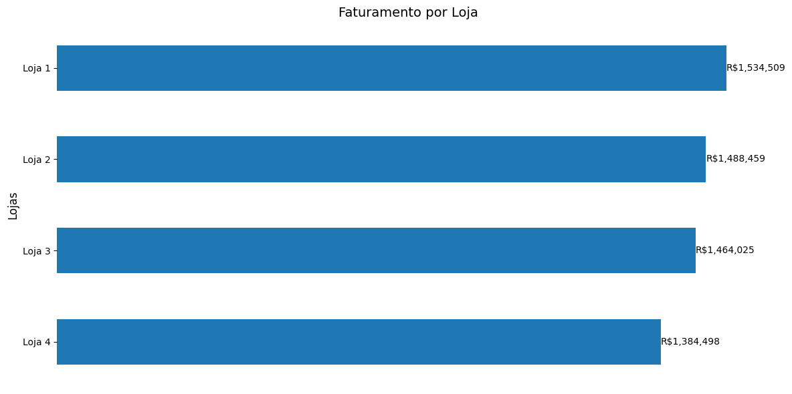
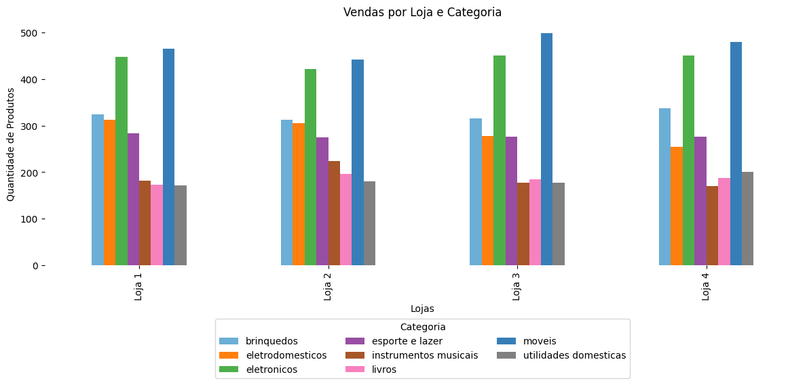
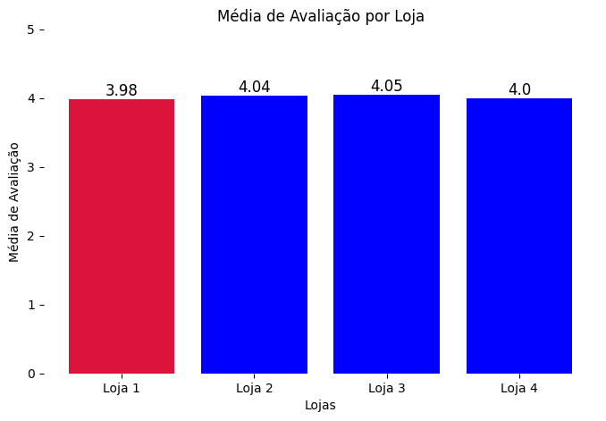
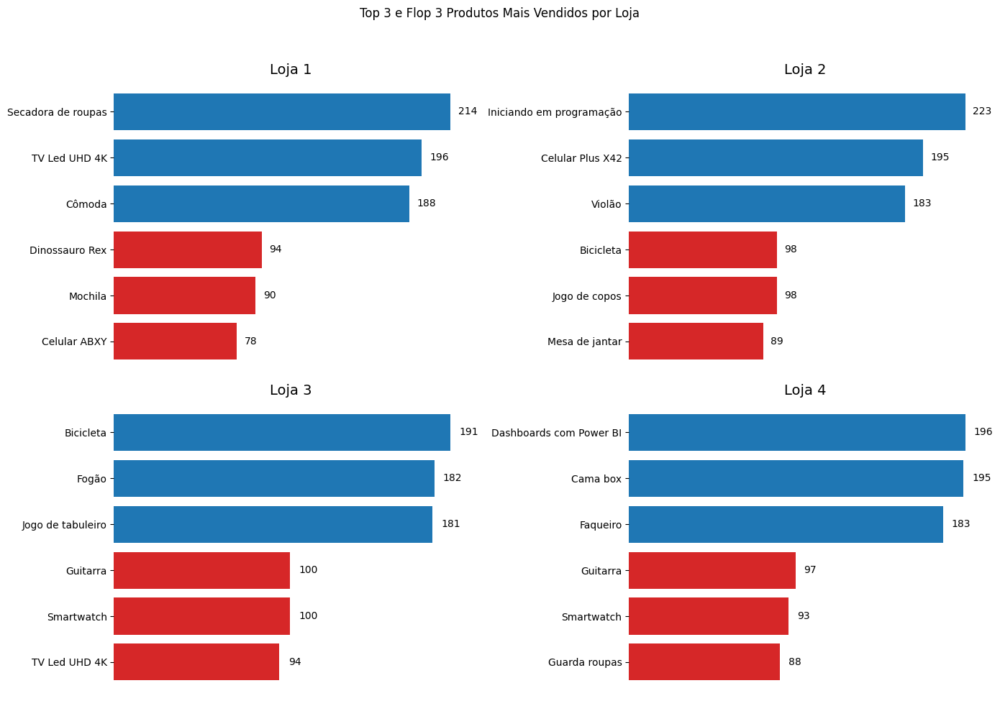

# **Apresentação do projeto de análise exploratória**


Este projeto de análise de dados foi desenvolvido como parte de um **desafio de formação Data Science da Alura** onde, iremos ajudar o Senhor João a decidir qual das suas quatro lojas (Loja 1, Loja 2, Loja 3 e Loja 4) ele deve vender. 

Para isso, analisei os dados de vendas usando Python e a biblioteca pandas. Também usei o matplotlib para criar gráficos e comparações entre as lojas, deixando a análise mais visual e fácil de entender.

**Foram considerados os seguintes indicadores:**

```
Faturamento total por loja

Categorias de produtos mais e menos vendidos

Média das avaliações dos clientes

Produtos mais e menos vendidos

Frete médio por loja

```

Com base nas análises realizadas e nos gráficos gerados, a seguir apresento o desenvolvimento da análise e a recomendação final.

## Análise do faturamento

O faturamento foi o primeiro indicador analisado:

Com base na análise do faturamento das quatro lojas, foi possível identificar que a Loja 1 teve o maior faturamento no período analisado, enquanto a Loja 4 apresentou o menor faturamento.



## Vendas por categoria

Com base na análise de performance de cada categoria em cada loja observamos que:

A **Loja 1** se destaca principalmente na venda de móveis, eletrônicos e eletrodomésticos, com um desempenho geral bem consistente. Em compensação, apresentou algumas fraquezas nas categorias de livros e utilidades domésticas.

A **Loja 2** teve bom desempenho nas vendas de livros e instrumentos musicais, mostrando um perfil equilibrado e talvez com foco maior em produtos culturais.

A **Loja 3** foi a que mais se destacou nas categorias de móveis e eletrônicos, com um perfil voltado para produtos de maior valor agregado.

Já a **Loja 4** teve o menor desempenho em várias categorias, mas se destacou nas vendas de brinquedos e utilidades domésticas, indicando que pode estar atendendo um público mais voltado para o lar e para crianças.



## Média de avaliação das lojas

Com base na análise das médias das notas de avaliação de cada loja, observa-se que: 

A **Loja 1** apresentou a **menor média de avaliação (3,98)**, ainda dentro de um patamar satisfatório. Esse resultado pode estar relacionado a uma logística menos eficiente — como sugerido pelo frete médio mais alto — ou a falhas pontuais no pós-venda.

A **Loja 4** vem logo em seguida, com uma **média de 4,00**. Mesmo com um desempenho geral de vendas mais baixo, conseguiu manter um bom nível de satisfação, o que pode indicar um atendimento mais direcionado e personalizado.

A **Loja 2** teve uma **média de 4,04**, reforçando seu perfil equilibrado e mostrando bom posicionamento em categorias com maior valorização cultural.

A **Loja 3** obteve a melhor **média de avaliação (4,05)**, o que pode indicar uma maior satisfação dos clientes, refletindo uma boa experiência de compra, qualidade dos produtos e eficiência no atendimento e na entrega.




## Produtos mais e menos vendidos

Com base na análise das médias das notas de avaliação de cada loja, observa-se que:

**Loja 1**

Entre os produtos mais vendidos estão a secadora de roupas (214 unidades), a TV LED UHD 4K (196 unidades) e a cômoda (188 unidades). Já entre os menos vendidos estão o dinossauro rex (94 unidades), a mochila (90 unidades) e o celular ABXY (78 unidades).


**Loja 2**

Os destaques de venda foram o livro Iniciando em Programação (223 unidades), o celular Plus X42 (195 unidades) e o violão (183 unidades). Os produtos com menor saída foram a bicicleta (98 unidades), o jogo de copos (98 unidades) e a mesa de jantar (89 unidades).


**Loja 3**

Os itens mais vendidos foram a bicicleta (191 unidades), o fogão (182 unidades) e o jogo de tabuleiro (181 unidades). Já entre os menos vendidos estão a guitarra (100 unidades), o smartwatch (100 unidades) e a TV LED UHD 4K (94 unidades).


**Loja 4**

Entre os produtos mais vendidos estão o curso Dashboard Power BI (196 unidades), a cama box (195 unidades) e o faqueiro (183 unidades). Os produtos de menor saída foram a guitarra (97 unidades), o smartwatch (93 unidades) e o guarda-roupas (88 unidades).



## Frete médio por loja

Com base na análise dos valores médios de frete de cada loja, observa-se que:

**Loja 1:**

Evidencia o maior custo total de frete e o maior frete médio em comparação com as demais lojas. Tal cenário pode ser reflexo de um elevado volume de pedidos. Contudo, é importante considerar a possibilidade de ineficiências nos processos logísticos ou um ticket médio de vendas inferior, o que poderia elevar a representatividade proporcional do custo de frete.

**Loja 2:**

Demonstra custos totais e médios de frete ligeiramente inferiores aos da Loja 1. Essa observação sugere um volume de vendas similar, acompanhado de uma operação logística potencialmente mais otimizada.

**Loja 3:**

Exibe o menor custo total de frete e o menor frete médio dentre as três primeiras lojas analisadas, indicando uma maior eficiência logística. Este resultado pode ser atribuído a fatores como um planejamento de rotas aprimorado, um maior volume de itens por pedido ou uma localização geográfica dos clientes mais favorável.

**Loja 4:**

Apresenta o menor custo total de frete e o menor frete médio, concomitantemente com o menor volume de vendas. Essa correlação sugere que os custos de frete reduzidos estão mais associados ao baixo volume de transações comerciais da loja do que a melhorias significativas na eficiência da sua logística.

## Conclusão

**Melhor Performance**: A **Loja 3** se destaca pela combinação de maior faturamento em categorias chave (como móveis e eletrônicos), melhor avaliação dos clientes (4.05) e custo médio de frete relativamente baixo. A sua liderança em vendas de produtos de maior valor (como móveis e eletrônicos) e sua alta avaliação indicam uma experiência de compra de qualidade, o que contribui para um desempenho superior.

**Pior Performance**: A **Loja 4** apresenta o menor faturamento, avaliação abaixo das outras lojas (4.0), e um desempenho inferior em algumas categorias chave, como instrumentos musicais e utilidades domésticas. Apesar de ter o menor custo de frete, o seu baixo volume de vendas e menor diversidade de categorias de produtos impactam negativamente sua performance geral.

Analisando as metricas como faturamento total, custo médio com frete, avaliação dos clientes, diversidade de categorias de produtos e localização geográfica,de forma global,  **recomendo que a empresa venda a Loja 4**.
